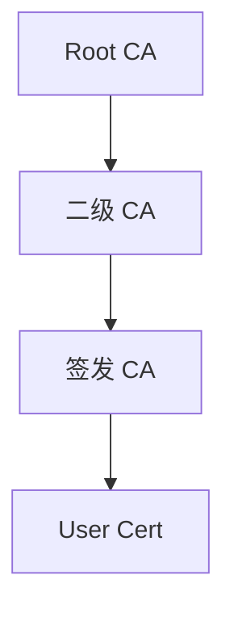

# 证书管理设计书

## 1. 系统定位

本系统是面向采埃孚网络安全团队和普通证书申请用户的 PKI / CA 证书管理平台。

系统核心目标：

- 网络安全团队管理 CA 体系。
- 网络安全团队配置证书模板。
- 用户通过 CSR 申请用户证书。
- 网络安全团队审批 CSR 申请。
- 网络安全团队手动签发证书。
- 网络安全团队管理、下载、更新、吊销证书。
- 所有关键操作进入审计日志。
- Root CA 第一版使用前端 demo 数据，后续对接供应商后端密码机 / HSM。

本版设计只围绕以下对象展开：

- CA
- 证书模板
- CSR 申请
- 已签发证书
- 用户
- 审计日志

## 2. 用户角色

| 角色 | 权限定位 |
|---|---|
| 网络安全团队业务管理员 | 最高权限，管理 CA、证书模板、证书审批、证书签发、证书吊销、审计 |
| 网络安全团队审批员 | 审批 CSR 申请、手动签发证书、吊销证书、查看 CA 和模板 |
| 网络安全团队审计员 | 只读查看 CA、证书、模板、申请和审计日志 |
| 普通用户 | 上传 CSR，申请自己可申请的用户证书，下载自己的证书 |

### 2.1 当前演示登录身份

当前前端演示版采用账号密码登录，而不是在系统内随意切换角色。登录身份决定进入后的导航、页面和可执行操作。

| 登录身份 | 演示账号 | 演示密码 | 当前权限范围 |
|---|---|---|---|
| PKI Manager | CyberTeam1 | 123123 | 进入网络安全团队管理端，可查看总览、证书审批、证书管理、CA 管理、证书模板、审计日志和系统设置 |
| PKI User | User1 | 321321 | 进入普通用户证书申请端，只能看到总览入口和 CSR 申请相关内容 |

登录页必须先选择登录身份，再输入账号和密码。若账号不属于所选身份，或密码不匹配，系统拒绝登录。

## 3. 权限原则

- 普通用户不能看到 CA 管理页面。
- 普通用户不能配置证书模板。
- 普通用户不能审批、签发、吊销证书。
- 普通用户只能提交 CSR 申请和下载自己的证书。
- 网络安全团队可以管理 CA、模板、证书和审批。
- 高风险 CA 操作需要二次确认。
- 高风险证书操作需要二次确认。
- 系统不提供真正删除 CA 的操作，只允许归档。
- 所有关键操作必须写入审计日志。
- 未登录用户不能进入任何业务页面，即使直接访问业务页面 hash，也只能看到登录封面。
- 当前演示版使用 `sessionStorage` 保存登录会话，刷新后保持当前登录身份；退出后清除会话。

## 4. CA 体系设计

### 4.1 CA 层级

系统采用三级 CA 体系：



### 4.2 Root CA

第一版前端内置一个演示 Root CA：

| 字段 | 值 |
|---|---|
| 名称 | 演示 Root CA |
| 类型 | Root CA |
| 来源 | 前端 Demo |
| 后续映射 | 供应商后端 Root CA + 密码机 / HSM |
| 私钥处理 | 前端不可见、不可导出、不可处理 |

Root CA 后续应由供应商后端提供真实信息。

### 4.3 CA 管理页面要求

网络安全团队进入 CA 管理后，应能直观看到：

- CA 树。
- Root CA 信息。
- Root CA 下挂载的二级 CA。
- 二级 CA 下挂载的签发 CA。
- 点击任意 CA 后查看该 CA 详情。
- 查看该 CA 下绑定的证书模板。
- 查看该 CA 下签发的证书。
- 对 CA 执行管理操作。

### 4.4 CA 可执行操作

| 操作 | 说明 | 是否高风险 |
|---|---|---|
| 查看 CA 信息 | 查看 CA 基本信息、Subject、算法、有效期、Key Usage | 否 |
| 查看 CA 证书 | 查看 CA 证书内容 | 否 |
| 下载证书链 | 下载 CA 证书链 | 否 |
| 创建下级 CA | 在当前 CA 下创建二级 CA 或签发 CA | 是 |
| 更新 CA 信息 | 修改 CA 基本配置 | 是 |
| 续期 CA | 更新 CA 有效期 | 是 |
| 暂停签发 | 暂停该 CA 签发能力 | 是 |
| 恢复签发 | 恢复该 CA 签发能力 | 是 |
| 吊销 CA | 吊销 CA | 是 |
| 归档 CA | 不再使用但保留历史 | 是 |

## 5. 证书模板设计

### 5.1 模板定位

证书模板用于定义用户证书如何被申请、校验和签发。

模板必须绑定到某个可签发用户证书的 CA。

普通用户不配置模板，只能选择网络安全团队配置好的可申请证书。

### 5.2 模板字段

| 字段 | 说明 |
|---|---|
| 模板名称 | 证书模板名称 |
| 证书类型 | 当前主要支持 User Cert |
| 绑定 CA | 该模板由哪个签发 CA 使用 |
| 模板版本 | 用于历史追溯 |
| 模板状态 | 草稿、已发布、已归档 |
| CSR 校验规则 | 校验 CSR 是否满足模板要求 |
| 证书有效期规则 | 签发证书的有效期策略 |
| X.509 标准字段 | Subject、Key Usage、Extended Key Usage 等 |
| 自定义 OID 字段 | UDS 0x29 相关扩展项 |

### 5.3 X.509 标准字段

模板需要支持配置：

- Version
- Serial Number Rule
- Signature Algorithm
- Issuer
- Validity
- Subject DN
- Subject Public Key Info
- Subject Key Identifier
- Authority Key Identifier
- Key Usage
- Extended Key Usage
- Basic Constraints
- CRL Distribution Point
- Authority Information Access
- Certificate Policies

### 5.4 自定义 OID 字段

模板需要支持直接新增自定义 OID 字段：

| 字段 | 说明 |
|---|---|
| 字段名称 | 前端展示名称 |
| OID | 扩展项 OID |
| ASN.1 类型 | 数据编码类型 |
| 最大长度 | 字段长度约束 |
| 是否必填 | Mandatory / Optional |
| 默认值 | 模板默认值 |
| 校验规则 | 前端和后端校验依据 |
| 字段来源 | 模板固定、用户输入、系统生成 |

优先支持：

- CertType
- TrustGrade
- DiagUserRole
- ECUVariantID
- ECUUniqueID
- SIDWhiteList
- DIDWhiteList
- RIDWhiteList
- MemSecWhiteList

## 6. CSR 申请与证书签发

### 6.1 普通用户申请方式

普通用户通过 CSR 申请证书：

- 上传 `.csr`
- 上传 `.pem`
- 上传 `.txt`
- 粘贴 CSR 文本

系统不在前端生成 CSR。

### 6.2 CSR 解析内容

系统应解析并展示：

- Subject / CN
- Public Key Algorithm
- Key Length / Curve
- Signature Algorithm
- CSR Fingerprint
- CSR 原文预览
- 模板校验结果
- 不匹配原因

### 6.3 证书申请状态

| 状态 | 说明 |
|---|---|
| 未提交 | 用户尚未提交 CSR |
| 已提交 | CSR 已提交 |
| CSR 已解析 | 系统完成解析 |
| 校验通过 | CSR 满足模板要求 |
| 校验失败 | CSR 不满足模板要求 |
| 待审批 | 等待网络安全团队审批 |
| 已拒绝 | 网络安全团队拒绝申请 |
| 待签发 | 审批通过，等待手动签发 |
| 已签发 | 证书已签发 |
| 已下载 | 用户已下载证书 |
| 已吊销 | 证书已吊销 |

### 6.4 签发规则

- 所有用户证书申请必须审批。
- 审批通过后不自动签发。
- 网络安全团队需要手动点击签发。
- 签发前不允许随意修改申请内容。
- 如需修改，应拒绝申请并要求用户重新提交。

## 7. 证书管理

网络安全团队在证书管理页面应能：

- 查看已签发证书列表。
- 按 CA、模板、状态、用户、有效期筛选证书。
- 查看证书详情。
- 查看证书对应 CSR。
- 查看证书使用的模板版本。
- 下载证书。
- 更新证书状态。
- 吊销证书。
- 查看证书审计记录。

证书下载格式：

- `.cer`
- `.pem`
- `.der`
- `.p7b`
- `.zip`

## 8. 证书审批

证书审批页面应展示：

- 待审批 CSR 申请。
- 申请用户。
- 选择的证书模板。
- 绑定 CA。
- CSR 解析结果。
- 模板校验结果。
- 审批意见。
- 批准按钮。
- 拒绝按钮。
- 审批后手动签发入口。

## 9. 审计日志

必须记录：

- 用户登录。
- 用户提交 CSR。
- CSR 解析。
- CSR 校验。
- 证书申请审批。
- 证书签发。
- 证书下载。
- 证书吊销。
- CA 创建。
- CA 更新。
- CA 暂停。
- CA 恢复。
- CA 续期。
- CA 吊销。
- CA 归档。
- 模板创建。
- 模板更新。
- 模板发布。
- OID 字段配置。

## 10. 页面结构

### 10.0 登录封面

系统入口为动态登录封面，使用网络安全 / PKI 主题背景承载第一视觉。登录卡片包含：

- 登录身份下拉框：PKI Manager / PKI User。
- 账号输入框。
- 密码输入框。
- 登录按钮。
- 右上角小型语言切换按钮，进入系统后延续所选语言。

登录卡片采用 ZF Blue 方向的工程蓝、深海军蓝、冷白和青蓝高亮色，卡片半透明，能够隐约透出背景图元素，但控件文字必须保持清晰可读。

### 10.1 网络安全团队页面

| 页面 | 作用 |
|---|---|
| 总览 | 查看 CA、证书模板、CSR、证书、审计等对象状态，并进入关键模块 |
| CA 管理 | 查看 CA 树、CA 详情、CA 操作、挂载模板、签发记录 |
| 证书管理 | 查看、下载、更新、吊销证书 |
| 证书审批 | 审批 CSR 申请并手动签发 |
| 证书模板 | 配置 X.509 字段、自定义 OID、CSR 校验规则、绑定 CA |
| 审计日志 | 查看所有关键操作记录 |
| 系统设置 | 查看 Root CA demo、供应商接口、HSM 对接状态 |

### 10.2 普通用户页面

| 页面 | 作用 |
|---|---|
| 用户证书申请 | 选择可申请证书，上传或粘贴 CSR |
| 我的申请 | 查看自己的申请状态 |
| 我的证书 | 下载自己的证书 |

当前演示版中，PKI User 登录后左侧仅显示总览入口，主工作区直接呈现用户证书申请表单，避免显示无法访问的管理按钮。

### 10.3 界面设计语言

系统定位为“符合 ZF 蓝色品牌气质的高端工程师工作台”，而不是普通蓝白后台模板。

设计关键词：

- ZF Blue
- German engineering
- automotive supplier
- cybersecurity portal
- certificate management
- precision dashboard
- engineering-grade UI

视觉原则：

- 主色以工程蓝为核心，配合深海军蓝、冷白、银灰、石墨黑和少量青蓝高亮。
- 页面层次采用深色顶部导航、浅色工作区、冷灰分区、蓝色关键操作和状态色辅助。
- 表单采用紧凑、精密、左标签右控件的工程表单布局。
- 表格行之间必须有清晰横线，单元格内容垂直居中。
- 证书编号、哈希、账号、时间戳、文件路径、日志内容等技术信息使用 mono 字体。
- 动效只用于登录封面、导航切换、状态反馈、按钮 hover、二次确认和 toast。

## 11. 前端架构建议

真实开发建议采用：

- React + Vite
- TypeScript
- React Router
- Tailwind CSS
- Framer Motion
- Mock API
- API Client
- 权限守卫
- 统一组件库

组件体系：

- AppShell
- ModuleEntryCard
- CaTree
- CaDetail
- OperationGrid
- TemplateDesigner
- CsrRequestForm
- CsrParsePanel
- ApprovalQueue
- CertificateTable
- CertificateDetail
- ConfirmModal
- AuditTimeline
- EmptyState

## 12. 后端接口边界

### 12.1 认证与用户

```text
POST /api/auth/login
POST /api/auth/logout
GET  /api/auth/me
GET  /api/users
POST /api/users/register
POST /api/users/{id}/approve
POST /api/users/{id}/reject
```

### 12.2 CA 管理

```text
GET  /api/cas
POST /api/cas
GET  /api/cas/{id}
PUT  /api/cas/{id}
POST /api/cas/{id}/activate
POST /api/cas/{id}/suspend
POST /api/cas/{id}/resume
POST /api/cas/{id}/renew
POST /api/cas/{id}/revoke
POST /api/cas/{id}/archive
GET  /api/cas/{id}/certificate
GET  /api/cas/{id}/chain
GET  /api/cas/{id}/templates
GET  /api/cas/{id}/certificates
GET  /api/cas/{id}/audit-logs
GET  /api/cas/{id}/health
```

### 12.3 模板管理

```text
GET  /api/templates
POST /api/templates
GET  /api/templates/{id}
PUT  /api/templates/{id}
POST /api/templates/{id}/publish
POST /api/templates/{id}/archive
POST /api/templates/{id}/bind-ca
GET  /api/templates/{id}/versions
POST /api/templates/{id}/oid-fields
PUT  /api/templates/{id}/oid-fields/{fieldId}
```

### 12.4 CSR 与证书申请

```text
POST /api/csr/parse
POST /api/csr/validate
POST /api/certificate-requests
GET  /api/certificate-requests
GET  /api/certificate-requests/{id}
POST /api/certificate-requests/{id}/approve
POST /api/certificate-requests/{id}/reject
POST /api/certificate-requests/{id}/issue
```

### 12.5 证书管理

```text
GET  /api/certificates
GET  /api/certificates/{id}
GET  /api/certificates/{id}/download?format=pem
GET  /api/certificates/{id}/chain
POST /api/certificates/{id}/renew
POST /api/certificates/{id}/revoke
GET  /api/certificates/{id}/audit-logs
```

### 12.6 审计

```text
GET /api/audit-logs
GET /api/audit-logs/{id}
```

## 13. 核心数据模型

```text
User
Role
CertificateAuthority
CertificateTemplate
CertificateTemplateVersion
TemplateOidField
CertificateRequest
CsrParseResult
ApprovalRecord
Certificate
CertificateDownloadRecord
CertificateRevocation
CaOperationRecord
AuditLog
```

关系：

- 一个 CA 可以有多个下级 CA。
- 一个签发 CA 可以绑定多个证书模板。
- 一个证书模板必须绑定到一个可签发证书的 CA。
- 一个用户通过一个证书模板提交一个 CSR 申请。
- 一个证书申请审批通过后，由网络安全团队手动签发证书。
- 一个证书来源于一个 CSR 申请。
- 所有关键操作产生审计日志。

## 14. 当前前端实现检查

### 14.1 已实现

| 功能 | 当前状态 |
|---|---|
| 动态登录封面 | 已实现，使用 PKI / cybersecurity 动态背景和半透明登录卡片 |
| 账号密码登录 | 已实现演示版，PKI Manager / PKI User 通过固定账号密码进入不同工作台 |
| 身份选择校验 | 已实现，账号必须匹配所选登录身份，否则拒绝登录 |
| 登录会话 | 已实现，使用 sessionStorage 保存当前登录身份，退出后清除 |
| 权限导航 | 已实现，PKI Manager 显示全部管理模块，PKI User 只显示总览入口 |
| 语言切换 | 已实现小型 English / Chinese toggle，进入系统后延续语言 |
| Root CA demo 信息展示 | 已实现 |
| CA 树基础展示 | 已实现，目前只有 Root CA |
| CA 操作按钮展示 | 已实现 |
| 高风险操作确认弹窗 | 已实现，确认后出现 toast 并写入模拟审计日志 |
| CA 创建页面 | 已实现演示表单，支持标准 CA 字段和可选自定义扩展字段 |
| 证书模板创建页面 | 已实现演示表单，支持 X.509 标准字段、CSR 校验规则和自定义 OID 扩展字段 |
| X.509 字段下拉 | 已实现，签名算法、公钥算法、Key Usage、EKU、AIA、CRL DP 等字段支持下拉选择 |
| 证书管理列表 | 已实现空状态和筛选表单 |
| 证书审批列表 | 已实现空状态、CSR 详情入口和审批流程结构 |
| 普通用户 CSR 申请表单 | 已实现演示表单，支持模板选择、CSR 文件提示、申请说明和 CSR 原文输入 |
| 审计日志 | 已实现基础展示和操作确认后的模拟记录 |
| UI 设计系统 | 已实现工程蓝主题、深色顶栏、浅色工作区、表格横线、mono 技术字体和紧凑表单布局 |

### 14.2 当前遗漏的逻辑功能

| 功能 | 缺口 |
|---|---|
| 真实后端认证 | 当前为前端演示账号，尚未对接后端用户、密码策略、token、单点登录或企业身份源 |
| 完整 RBAC | 当前按 PKI Manager / PKI User 两类演示身份控制导航，尚未实现细粒度审批员、审计员、管理员权限 |
| CA 创建状态写入 | 当前有创建表单和确认弹窗，但尚未写入真实 CA 树 |
| CA 编辑 | 目前有操作入口和确认弹窗，尚未实现真实编辑数据保存 |
| CA 更新 / 续期 / 暂停 / 恢复 / 吊销 / 归档 | 当前为确认与审计模拟，尚未对接真实状态流转 |
| 动态 CA 树 | 目前只有 Root CA，无法新增下级 CA |
| CA 证书查看 | 只有入口，没有证书详情弹窗 |
| CA 证书链下载 | 只有入口，没有下载文件 |
| 模板真实保存 | 当前有创建表单，但尚未保存到真实模板列表 |
| 模板字段持久化 | X.509 字段和 OID 字段当前为前端表单，尚未持久化 |
| 模板绑定 CA | 未实现 |
| 模板版本管理 | 未实现 |
| CSR 文件上传 | 当前为表单占位，尚未读取真实文件内容 |
| CSR 粘贴 | 已有输入区域，尚未做真实解析 |
| CSR 解析 | 未实现 |
| CSR 模板校验 | 未实现 |
| 证书审批队列 | 目前为空状态，没有数据模型 |
| 审批通过 / 拒绝 | 未实现 |
| 手动签发 | 未实现 |
| 证书列表 | 目前为空状态，没有数据模型 |
| 证书详情 | 未实现 |
| 证书下载 | 未实现 |
| 证书更新 | 未实现 |
| 证书吊销 | 未实现 |
| 吊销 reason code | 未实现 |
| 审计日志完整记录 | 只有简单模拟记录 |
| 数据持久化 | 当前刷新后不保留操作 |
| Mock API | 未实现独立 Mock API 层 |
| 供应商接口适配 | 未实现 |
| HSM 状态展示 | 只有文字说明，没有接口和状态 |

## 15. 下一步开发优先级

1. 建立 Mock API 和本地数据状态，先让 CA、模板、CSR、证书、审计日志具备可演示的数据流。
2. 实现真实登录接口、会话接口和后端权限守卫，替换当前前端演示账号。
3. 实现 CA 创建、编辑、状态流转和动态 CA 树。
4. 实现证书模板保存、字段配置、OID 配置、版本管理和绑定 CA。
5. 实现 CSR 文件上传、CSR 解析、模板校验和申请提交。
6. 实现审批通过 / 拒绝 / 手动签发的完整状态机。
7. 实现证书列表、证书详情、证书下载、吊销和吊销 reason code。
8. 实现完整审计日志，包括登录、申请、审批、签发、下载、吊销、CA 操作和模板操作。
9. 对接供应商真实 CA / HSM / 证书签发接口，并补充异常状态、接口超时和失败回滚处理。
10. 进行移动端、桌面端、无数据、有数据、错误态、加载态的完整 UI 回归测试。

## 16. 演示交付包

当前前端演示版已整理为可直接 clone 后演示的静态项目，上传目标仓库为 `Jia660913/PKI_setup`。

交付包内容：

- `index.html`：仓库根目录演示入口，打开后自动进入完整前端系统。
- `cybersecurity-certificate-portal/`：当前最新证书管理平台前端实现，包含登录封面、角色权限、业务页面、样式、脚本、数据和图片资源。
- `DEMO_ACCOUNTS.txt`：演示账号密码说明。
- `docs/证书管理设计书.md`：本设计书。

clone 后演示方式：

1. 打开仓库根目录 `index.html`。
2. 选择登录身份。
3. 使用 `PKI Manager / CyberTeam1 / 123123` 进入管理端。
4. 使用 `PKI User / User1 / 321321` 进入普通用户证书申请端。
5. 查看 `docs/证书管理设计书.md` 进行系统逻辑和设计说明。
